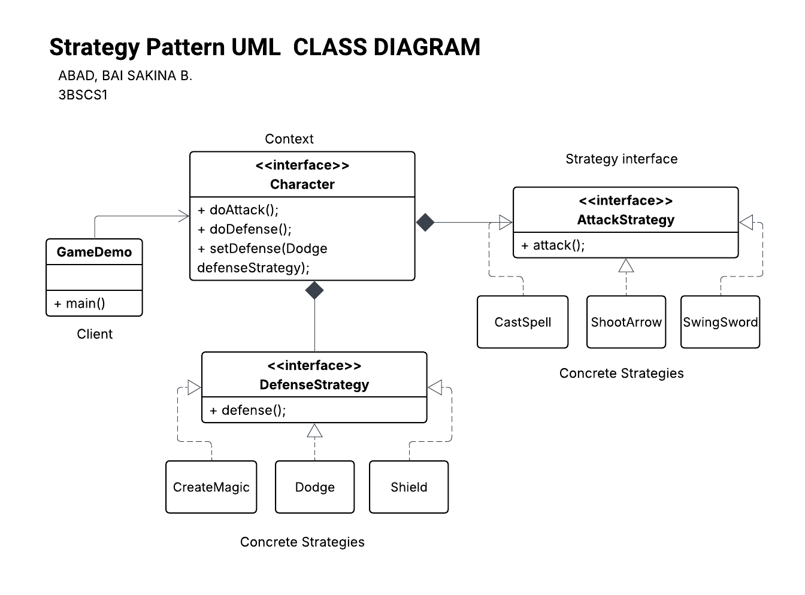

# ABAD-3BSCS1-Lab-Assignment-1-Strategy-Pattern
This README is designed to be clean, professional, and ready for your GitHub repository. It breaks down the transition from rigid `if-else` logic to a flexible **Strategy Pattern** implementation.

---

# Strategy Pattern: Game character_types.Character System

A demonstration of the **Strategy Design Pattern** applied to a game character system. This implementation decouples the attack and defense behaviors from the `character_types.Character` class, allowing for dynamic behavior changes at runtime.

## Problem Scenario

The original `character_types.Character` class used a monolithic approach with nested `if-else` statements to determine actions based on character type. This made the code:

* **Rigid:** Adding a new character or behavior required modifying the core class.
* **Hard to Maintain:** Logic for multiple behaviors (Sword, Spells, Shields) was tangled together.
* **Violation of OCP:** It violated the Open/Closed Principle (Open for extension, closed for modification).

## Strategies
Suppose we have three types of characters in a GameApp:

    1. character_types.Knight: Attacks with a sword; uses 3 strategies to defend (shield, dodge, magic barrier)
    2. character_types.Wizard: Casts spells; uses magic barrier to defend
    3. character_types.Archer: Shoots arrows; uses dodge to defend

Implement two types of Strategy:
A.  defenses.DefenseStrategy

    1. defenses.Shield
    2. defenses.Dodge
    3. defenses.CreateMagic

B.  attacks.AttackStrategy

    1.  attacks.CastSpell
    2.  attacks.ShootArrow
    3.  attacks.SwingSword

## UML
 